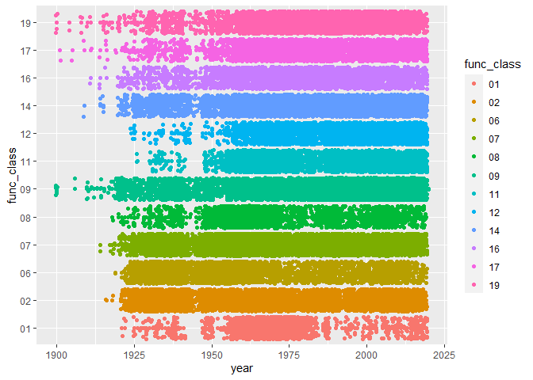

    data_wi = read_csv("D:/STAT 433/2020HwyBridgesDelimitedAllStates.txt") %>% 
      filter(STATE_CODE_001=="48") %>% 
      select(STATE_CODE_001,STRUCTURE_NUMBER_008,COUNTY_CODE_003,FUNCTIONAL_CLASS_026,YEAR_BUILT_027) %>% 
      rename(state_code=STATE_CODE_001,structure_num=STRUCTURE_NUMBER_008, county_code=COUNTY_CODE_003, func_class=FUNCTIONAL_CLASS_026, year=YEAR_BUILT_027)

    ## Rows: 618456 Columns: 123

    ## -- Column specification --------------------------------------------------------
    ## Delimiter: ","
    ## chr (54): STATE_CODE_001, STRUCTURE_NUMBER_008, ROUTE_NUMBER_005D, HIGHWAY_D...
    ## dbl (67): RECORD_TYPE_005A, ROUTE_PREFIX_005B, SERVICE_LEVEL_005C, DIRECTION...
    ## lgl  (2): CRITICAL_FACILITY_006B, TEMP_STRUCTURE_103

    ## 
    ## i Use `spec()` to retrieve the full column specification for this data.
    ## i Specify the column types or set `show_col_types = FALSE` to quiet this message.

    head(data_wi)

    ## # A tibble: 6 x 5
    ##   state_code structure_num   county_code func_class  year
    ##   <chr>      <chr>           <chr>       <chr>      <dbl>
    ## 1 48         0000000L2015318 375         09          2008
    ## 2 48         000021521-00101 071         09          2005
    ## 3 48         000021521-00181 071         09          2005
    ## 4 48         000021521-TMP20 071         09          2012
    ## 5 48         000021525-00012 245         09          1950
    ## 6 48         000021525-00014 245         09          1990

    ggplot(data = data_wi,aes(x = year, y=func_class, color = func_class))+
      geom_point()+
      geom_jitter()

